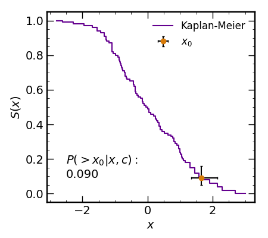

# KaplanMeier

Statistical assessments with the Kaplan-Meier survival function (lower/upper 
limits) to test whether a measured value `x0` (typically the mean of a 
distribution) is associated with some population `x`, accounting for lower 
limits in `x`. If the Kaplan-Meier survival function at `x0` is outside the 
limits of 0.01 to 0.99, one can confidently reject the null hypothesis that 
the measurement `x0` is associated with the measurements `x`.

I originally developed and implemented this script for Flury et al. 2024
for tests involving a sample of 89 Lyman continuum measurements,
39 of which were upper limits requiring the censoring treatment of
the Kaplan-Meier survival curve.

## Examples

### Kaplan Meier Survival Test

``` python
import matplotlib.pyplot as plt
from numpy.random import seed,rand,randn
from KaplanMeier import *

seed(123)
x = randn(100)
c = rand(100)<0.3
x0 = array([1.65])
x0_err = array([[0.3],[0.5]])

km_x,km_y = km_curve(x,c)
p_x,p_e = km_eval(x0,x,c,x0_err=x0_err)
```
which gives the results below



### Mantel Log Rank Test with Kaplan Meier Survival

``` python
from numpy.random import seed,rand,randn
from KaplanMeier import *
seed(123)
x1 = rand(50) # all reference measurements
c1 = x1<0.1 # where measurements are upper limits
x2 = randn(30)*0.1+0.5 # new/test measurements
c2 = x2<-0.1 # where measurements are upper limits
D,T,pvalue = km_logrank(x1,c1,x2,c2) # get p-value
print(f'p-value = {pvalue:.6f}')
```
which prints the following to the command line
``` python
p-value = 0.005178
```

## BibTeX reference

While this code is provided publicly, I request that any use 
thereof be cited in any publications in which this code is used.
BibTeX formatted reference provided below.

``` bibtex
@ARTICLE{Flury2024,
       author = {{Flury}, Sophia R. and {Jaskot}, Anne E. and {the LzLCS Collaboration}},
        title = "{The Low-Redshift Lyman Continuum Survey: The Roles of Stellar Feedback and ISM Geometry in LyC Escape}",
      journal = {\apjs},
     keywords = {Reionization, Galactic and extragalactic astronomy, Ultraviolet astronomy, Hubble Space Telescope, 1383, 563, 1736, 761, Astrophysics - Astrophysics of Galaxies, Astrophysics - Cosmology and Nongalactic Astrophysics},
         year = 2024,
        month = {},
       volume = {},
       number = {},
          eid = {},
        pages = {},
          doi = {10.48550/arXiv.2409.12118},
archivePrefix = {arXiv},
       eprint = {2409.12118},
          url = {https://github.com/sflury/KaplanMeier},
 primaryClass = {astro-ph.GA},
       adsurl = {https://ui.adsabs.harvard.edu/abs/},
      adsnote = {Provided by the SAO/NASA Astrophysics Data System} }
```

An additional reference to consider is the original Kaplan & Meier (1958) paper 
which first presented the Kaplan-Meier statistic. The BibTeX entry for their
paper is listed below.

``` bibtex
@article{KaplanMeier1958,
author = {E. L. Kaplan and Paul Meier},
title = {Nonparametric Estimation from Incomplete Observations},
journal = {Journal of the American Statistical Association},
volume = {53},
number = {282},
pages = {457-481},
year = {1958},
publisher = {Taylor & Francis},
doi = {10.1080/01621459.1958.10501452},
}
```

The related log-rank test is based on the formalism from Mantel (1966). The
BibTeX entrey for his paper is listed below.

``` bibtex
@article{Mantel1966,
title={Evaluation of survival data and two new rank order statistics arising in its consideration},
author={Nathan Mantel},
journal={Cancer Chemotherapy Reports},
year={1966},
volume={50},
number={3},
pages={163-170}
}
```

## DOI

[](https://doi.org/10.5281/zenodo.11406486)

## Licensing
This program is free software: you can redistribute it and/or modify it under the terms of the GNU General Public License as published by the Free Software Foundation, either version 3 of the License, or (at your option) any later version. This program is distributed in the hope that it will be useful, but WITHOUT ANY WARRANTY; without even the implied warranty of MERCHANTABILITY or FITNESS FOR A PARTICULAR PURPOSE. See the GNU General Public License for more details.

You should have received a copy of the GNU General Public License along with this program. If not, see <https://www.gnu.org/licenses/>.
